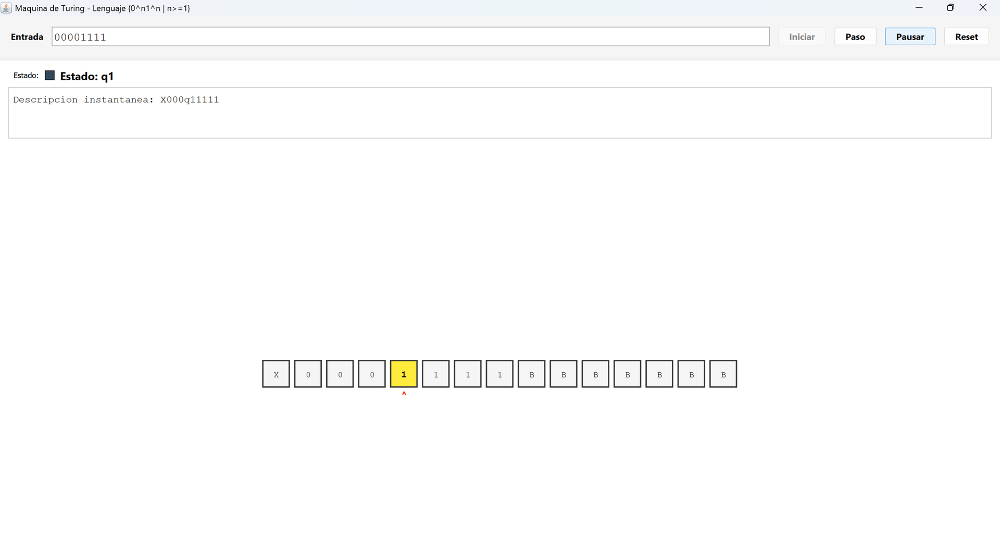
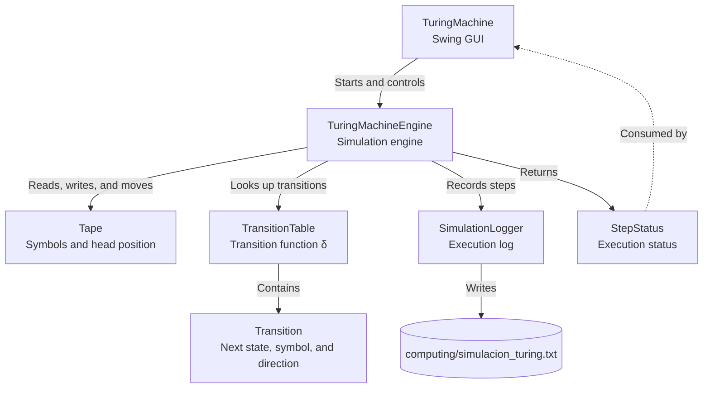
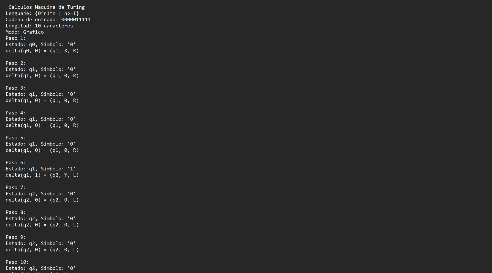

<h1 align="center">Turing Machine Simulator</h1>

<p align="center">
  <i>Formal language recognizer {0ⁿ1ⁿ | n≥1} with step-by-step visualization and automatic logging system.</i>
</p>

<p align="center">
  
  
  
  
  
  
</p>

---

<p align="center">
  
</p>

---

## Introduction

Turing Machine simulator implemented in Java with Swing GUI that recognizes the formal language **L = {0ⁿ1ⁿ | n≥1}**. The system features step-by-step tape visualization, state tracking, transition animations, and automatic simulation log generation.

The formal foundations and analysis of the project are documented in the [PDF report (MaquinaT.pdf)](latex/MaquinaT.pdf), including the formal definition of the Turing machine, transition diagrams, instantaneous descriptions, complexity analysis, and results.

---

## Table of Contents

- [Introduction](#introduction)
- [Table of Contents](#table-of-contents)
- [Description](#description)
- [System Architecture](#system-architecture)
  - [Core Components](#core-components)
- [Project Structure](#project-structure)
- [Technology Stack](#technology-stack)
  - [Backend \& Core](#backend--core)
  - [Data Structures](#data-structures)
- [Prerequisites](#prerequisites)
  - [Installation Verification](#installation-verification)
- [Installation and Execution](#installation-and-execution)
  - [Step 1: Clone or Download Files](#step-1-clone-or-download-files)
  - [Step 2: Compile the Project](#step-2-compile-the-project)
  - [Step 3: Run the Simulator](#step-3-run-the-simulator)
  - [Step 4: Use the Simulator](#step-4-use-the-simulator)
- [Language Characteristics](#language-characteristics)
  - [Formal Definition](#formal-definition)
  - [Examples](#examples)
- [Transition Table](#transition-table)
  - [Transition Function δ](#transition-function-δ)
  - [State Descriptions](#state-descriptions)
  - [Alphabet Symbols](#alphabet-symbols)
- [Data Model](#data-model)
  - [Class: Tape](#class-tape)
  - [Class: Transition](#class-transition)
  - [Class: TransitionTable](#class-transitiontable)
  - [Class: TuringMachineEngine](#class-turingmachineengine)
  - [Enum: StepStatus](#enum-stepstatus)
- [Useful Commands](#useful-commands)
  - [Compilation](#compilation)
  - [Execution](#execution)
  - [Verification](#verification)
- [System Features](#system-features)
  - [Functionalities](#functionalities)
  - [Execution Modes](#execution-modes)
- [Usage Examples](#usage-examples)
  - [Example 1: Simple Accepted String](#example-1-simple-accepted-string)
  - [Example 2: Complex Accepted String](#example-2-complex-accepted-string)
  - [Example 3: Rejected String](#example-3-rejected-string)
  - [Generated Log File](#generated-log-file)
- [Troubleshooting](#troubleshooting)
  - [Error: "Main class not found"](#error-main-class-not-found)
  - [Error: Incompatible Java version](#error-incompatible-java-version)
  - [Window does not display](#window-does-not-display)
  - [Log file not generated](#log-file-not-generated)
  - [Simulation too slow](#simulation-too-slow)
  - [Step limit reached](#step-limit-reached)
- [Author](#author)
- [License](#license)

---

## Description

Turing Machine simulator implemented in Java with Swing GUI that recognizes the formal language **L = {0ⁿ1ⁿ | n≥1}**. The system includes step-by-step visualization of the tape, states, and transitions, plus automatic simulation log generation.

| Component | Description |
|----------|-------------|
| Language | {0ⁿ1ⁿ \| n≥1} |
| States | 5 states (q0, q1, q2, q3, q4) |
| Symbols | {0, 1, X, Y, B} |
| Modes | Graphic and Non-Graphic |

---

## System Architecture



### Core Components

**Model:**
- **TuringMachineEngine** - Simulation engine
- **Tape** - Infinite tape representation
- **TransitionTable** - Transition table δ
- **Transition** - Individual transition object

**View:**
- **TuringMachine** - Main GUI interface

**Utilities:**
- **SimulationLogger** - Log generator
- **StepStatus** - Execution states (enum)

---

## Project Structure

```
TuringMachine/
├── TuringMachine.java          # Main class with Swing GUI
├── TuringMachineEngine.java    # TM simulation engine
├── Tape.java                   # Tape representation
├── Transition.java             # Transition object (δ)
├── TransitionTable.java        # Complete transition table
├── SimulationLogger.java       # Log file generator
├── StepStatus.java             # Execution state enum
├── .gitignore                  # Git ignored files
├── computing/                  # Computation logs directory
│   └── simulacion_turing.txt   # Generated simulation log
├── image/                      # Project images and demos
│   └── turing.gif              # Execution demo
└── README.md                   # This file
```

---

## Technology Stack

### Backend & Core

| Technology | Version | Usage |
|-----------|---------|------|
| Java SE | 18+ | Main language |
| Swing | Built-in | GUI framework |
| AWT | Built-in | Graphics and events |
| Collections | Built-in | Data structures |
| Optional | Built-in | Absence handling |
| Timer | Built-in | Animation |

### Data Structures

| Structure | Usage |
|-----------|------|
| HashMap | Transition table |
| ArrayList | Tape symbols |
| Timer | Automatic animation |

---

## Prerequisites

- JDK 18 or higher
- Operating system: Windows, Linux, or macOS

### Installation Verification

```bash
java --version
javac --version
```

Expected output:
```
java version "18.0.x" or higher
javac 18.0.x
```

---

## Installation and Execution

### Step 1: Clone or Download Files

```bash
# If in a repository
git clone <repository-url>
cd ESCOM/TuringMachine

# Or manually download all .java files
```

### Step 2: Compile the Project

```bash
javac *.java
```

This command compiles all Java files in the current directory.

### Step 3: Run the Simulator

```bash
java TuringMachine
```

The simulator main window will open.

### Step 4: Use the Simulator

1. **Enter string**: Type in "Input string" field (example: `0011`)
2. **Start**: Click "Iniciar" (Start) button
3. **Step by step**: Click "Paso" (Step) to advance manually
4. **Automatic**: Click "Auto" for continuous execution
5. **Reset**: Click "Reset" to clear and start over

---

## Language Characteristics

### Formal Definition

**L = {0ⁿ1ⁿ | n≥1}**

This language accepts strings that have:
- A sequence of **n** zeros (n ≥ 1)
- Followed by exactly **n** ones

### Examples

| String | Belongs? | Reason |
|--------|----------|--------|
| `01` |  Yes | n=1: one 0 and one 1 |
| `0011` |  Yes | n=2: two 0s and two 1s |
| `000111` |  Yes | n=3: three 0s and three 1s |
| `00001111` |  Yes | n=4: four 0s and four 1s |
| `001` |  No | Different count (2≠1) |
| `0111` |  No | Different count (1≠3) |
| `0101` |  No | Not of form 0ⁿ1ⁿ |
| `1100` |  No | Wrong order |
| `ε` (empty) |  No | n must be ≥1 |
| `0` |  No | Missing 1s part |

---

## Transition Table

### Transition Function δ

The transition table implemented in [TransitionTable.java](TransitionTable.java):

| Current State | Read Symbol | Next State | Write Symbol | Direction |
|---------------|-------------|------------|--------------|-----------|
| q0 | 0 | q1 | X | R |
| q0 | Y | q3 | Y | R |
| q1 | 0 | q1 | 0 | R |
| q1 | 1 | q2 | Y | L |
| q1 | Y | q1 | Y | R |
| q2 | 0 | q2 | 0 | L |
| q2 | X | q0 | X | R |
| q2 | Y | q2 | Y | L |
| q3 | Y | q3 | Y | R |
| q3 | B | q4 | B | R |

### State Descriptions

| State | Type | Description |
|--------|------|-------------|
| q0 | Initial | Finds first 0 and marks with X |
| q1 | Intermediate | Advances until finding corresponding 1 |
| q2 | Backtrack | Returns to next unmarked 0 |
| q3 | Verification | Checks only Ys and blanks remain |
| q4 | Acceptance | Final state - string accepted |

### Alphabet Symbols

| Symbol | Meaning |
|---------|-------------|
| 0 | Original zero from input |
| 1 | Original one from input |
| X | Mark for processed 0 |
| Y | Mark for processed 1 |
| B | Blank (empty space on tape) |

---

## Data Model

### Class: Tape

Represents the Turing Machine's infinite tape.

| Field | Type | Description |
|-------|------|-------------|
| symbols | List\<Character\> | List of symbols on tape |
| blankSymbol | char | Blank symbol ('B') |
| headPosition | int | Current head position |

**Main methods:**
- `read()` - Read symbol at current position
- `write(char)` - Write symbol at current position
- `moveLeft()` - Move head left
- `moveRight()` - Move head right

### Class: Transition

Represents a transition δ(q, a) = (q', b, D).

| Field | Type | Description |
|-------|------|-------------|
| nextState | String | Destination state (q') |
| writeSymbol | char | Symbol to write (b) |
| direction | char | Direction ('L' or 'R') |

### Class: TransitionTable

Stores all transition function rules.

| Field | Type | Description |
|-------|------|-------------|
| transitions | Map\<String, Map\<Character, Transition\>\> | Nested map for δ(state, symbol) |

**Main methods:**
- `get(String state, char symbol)` - Returns Optional\<Transition\>
- `buildDefaultTable()` - Initializes transition table for {0ⁿ1ⁿ}

### Class: TuringMachineEngine

Core execution engine for the TM.

| Field | Type | Description |
|-------|------|-------------|
| tape | Tape | Working tape |
| currentState | String | Current state |
| step | int | Step counter |
| halted | boolean | Execution stopped? |
| accepted | boolean | String accepted? |
| logger | SimulationLogger | Execution logger |

**Main methods:**
- `start(String input, boolean graphicMode)` - Initialize with input
- `step()` - Execute one transition step
- `getCurrentConfiguration()` - Get current TM state

### Enum: StepStatus

Represents execution states.

| Value | Description |
|--------|-------------|
| RUNNING | Simulation in progress |
| ACCEPTED | String accepted (reached q4) |
| REJECTED | String rejected (no transition) |
| LOOP_LIMIT | Maximum steps exceeded |

---

## Useful Commands

### Compilation

```bash
# Compile all files
javac *.java

# Compile specific file
javac TuringMachine.java

# Compile with warnings
javac -Xlint *.java

# Clean compiled files
rm *.class
# Windows PowerShell:
# Remove-Item *.class
```

### Execution

```bash
# Run the application
java TuringMachine

# Run with more memory (optional)
java -Xmx512m TuringMachine

# View debug information
java -verbose TuringMachine
```

### Verification

```bash
# List generated .class files
ls *.class
# Windows PowerShell:
# Get-ChildItem *.class

# Check generated log file
cat computing/simulacion_turing.txt
# Windows PowerShell:
# Get-Content computing/simulacion_turing.txt

# View file content with tail
tail -n 20 computing/simulacion_turing.txt
# Windows PowerShell:
# Get-Content computing/simulacion_turing.txt -Tail 20
```

---

## System Features

### Functionalities

- Recognition of language {0ⁿ1ⁿ | n≥1}
- Real-time graphic tape visualization
- Step-by-step execution with manual control
- Automatic mode with animation
- Visual indicators of current state
- Instant configuration description
- Automatic detailed log generation
- Accepted/rejected string detection
- Step limit to avoid infinite loops
- Intuitive interface with control buttons
- Progress bar for visual feedback
- State color coding system
- Scrollable tape view
- Monospaced font for better readability

### Execution Modes

**Graphic Mode:**
- Animated tape visualization
- Maximum 1000 steps
- Detailed log of each step
- Adjustable speed (500ms Timer)
- Interactive controls

**Non-Graphic Mode:**
- Fast execution without UI
- Maximum 10,000 steps
- Log every 10 steps (optimized)
- For long-length strings
- Batch processing capable

---

## Usage Examples

### Example 1: Simple Accepted String

**Input:** `01`

**Process:**
1. q0 reads '0' → writes 'X', goes to q1, moves R
2. q1 reads '1' → writes 'Y', goes to q2, moves L
3. q2 reads 'X' → keeps 'X', goes to q0, moves R
4. q0 reads 'Y' → keeps 'Y', goes to q3, moves R
5. q3 reads 'B' → keeps 'B', goes to q4, moves R

**Result:**  **ACCEPTED**

### Example 2: Complex Accepted String

**Input:** `000111`

**Tape during execution:**
```
Step 0:  [0]00111BBBBBBBBBB  (q0)
Step 5:  X0[0]111BBBBBBBBBB  (q0)
Step 15: XX[0]111BBBBBBBBBB  (q0)
Step 25: XXXY[Y]YBBBBBBBBBB  (q3)
Step 27: XXXYYYB[B]BBBBBBB   (q4) 
```

**Result:**  **ACCEPTED** in 27 steps

### Example 3: Rejected String

**Input:** `001`

**Process:**
1. Marks first 0 as X
2. Finds and marks first 1 as Y
3. Marks second 0 as X
4. Searches for second 1... DOES NOT EXIST
5. No valid transition

**Result:**  **REJECTED**

### Generated Log File

The file [computing/simulacion_turing.txt](computing/simulacion_turing.txt) contains:

```
 Calculos Maquina de Turing 
Lenguaje: {0^n1^n | n>=1}
Cadena de entrada: 0011
Longitud: 4 caracteres
Modo: Grafico

Paso 1:
Estado: q0, Simbolo: '0'
delta(q0, 0) = (q1, X, R)

Paso 2:
Estado: q1, Simbolo: '0'
delta(q1, 0) = (q1, 0, R)

...

Estado de aceptacion alcanzado
Cadena aceptada
Total de pasos: 15
La cadena pertenece al lenguaje {0^n1^n | n>=1}
```

<p align="center">
  
  <br>
  <i>Complete computation history and calculations stored in computing directory</i>
</p>

---

## Troubleshooting

### Error: "Main class not found"

```bash
# Verify files are compiled
ls *.class

# Recompile
javac *.java

# Run from correct directory
java TuringMachine
```

### Error: Incompatible Java version

```bash
# Check version
java --version

# If less than 18, update JDK
# Download from: https://www.oracle.com/java/technologies/downloads/
```

### Window does not display

```bash
# Verify DISPLAY is configured (Linux)
echo $DISPLAY

# On Windows, check for permission errors
# Run as administrator if necessary

# Check if Java GUI is supported
java -version
```

### Log file not generated

```bash
# Check write permissions in directory
ls -la

# Windows PowerShell:
# Get-Acl .

# Give permissions if necessary
chmod 755 .

# Verify file was created in computing directory
ls -l computing/simulacion_turing.txt
```

### Simulation too slow

**Solution 1:** Adjust timer speed
- Modify line in [TuringMachine.java](TuringMachine.java):
```java
animationTimer = new javax.swing.Timer(500, this::siguientePasoAuto);
// Change 500 to 200 for higher speed
```

**Solution 2:** Use non-graphic mode for long strings

### Step limit reached

**Cause:** Very long string or possible loop

**Solution:**
- Graphic mode: 1000 step limit
- Non-graphic mode: 10,000 step limit
- Modify `maxSteps` in [TuringMachineEngine.java](TuringMachineEngine.java) if needed

```java
if(graphicMode){
    this.maxSteps = 1000;
}else{
    this.maxSteps = Math.max(10000, tape.size() * 100);
}
// Increase limits as needed
```

---

## Author

**Carlos Elias Linares Ojeda**
- Course: Theory of Computation
- Institution: ESCOM-IPN
- Version: 3.0
- Date: June 20, 2025

---

## License

This project was developed for academic purposes for the Theory of Computation course at ESCOM-IPN.
